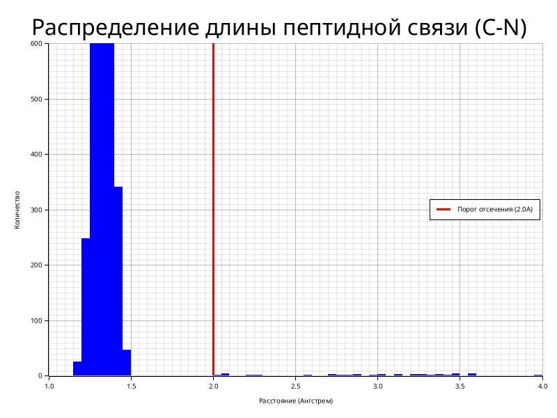

# Разработка высокопроизводительного алгоритмического комплекса для гуманизации антител на основе структурного сопоставления

**Автор:** Софрыгин Лука
**Научный руководитель:** Блохин Никита (компания BIOCAD)

## 1. Актуальность и постановка задачи

Создание современных лекарств на основе антител животных (например, лам или верблюдов) является одним из наиболее перспективных направлений биофармацевтики. Такие антитела обладают уникальными свойствами, однако их прямое использование в терапии человека невозможно из-за высокого риска иммунного отторжения. Для решения этой проблемы применяется процесс гуманизации — пересадка активных участков (CDR), отвечающих за связывание с мишенью, на человеческий белковый каркас.

Изначальный прототип системы, реализованный автором на языке Python, оказался недостаточно эффективным для промышленного применения. Интерпретируемая природа языка и отсутствие строгой типизации приводили к критическим задержкам при обработке массивов данных, содержащих тысячи белковых структур. Время «холодного» старта, инициализации базы данных и поиска занимало часы, что делало невозможным оперативное тестирование научных гипотез.

Целью данной работы стало создание автономного высокопроизводительного программного комплекса `scaffolding-rs` на системном языке программирования Rust. Переход на компилируемый код и использование строгих алгоритмических методов сравнения пространственных структур позволили на несколько порядков ускорить процесс подбора каркасов при сохранении строгой биологической релевантности результатов.

## 2. Методы решения

Ключевым этапом работы стал полный рефакторинг системы. Выбор языка **Rust** обусловлен необходимостью строгого управления памятью без использования сборщика мусора, гарантированной безопасностью многопоточных вычислений и высокой скоростью исполнения бинарного кода.

### Технологические решения

*   **Хранение данных**: Был осуществлен отказ от файловой системы в пользу встраиваемой базы данных **SQLite** в режиме опережающей записи (WAL). Это позволило хранить тысячи PDB-структур и их метаданные в одном компактном файле, обеспечивая эффективный параллельный доступ на чтение и запись без блокировок, что критично для многопоточной обработки.
*   **Параллелизм**: С использованием библиотеки `rayon` реализовано распараллеливание тяжелых геометрических вычислений (расчет двугранных углов, наложение структур) на все доступные ядра процессора, что обеспечило линейную масштабируемость производительности.

### Алгоритмические решения

1.  **Подготовка и очистка данных**: База данных SAbDab содержит структуры разного качества. Был разработан модуль валидации, который анализирует каждый файл на наличие пропусков в нумерации аминокислот и геометрических разрывов в белковой цепи (расстояние между атомами углерода и азота соседних остатков более 2.0 Å). Структуры, не прошедшие проверку, помечаются и исключаются. В ходе обработки тестовой выборки было сохранено **90%** наиболее достоверных структур (4500 из 5000), что исключило «шум» в результатах.

*Рис. 1. Распределение длины пептидной связи в базе. Выбросы справа от пунктирной линии (2.0А) указывают на физические разрывы цепи и отсеиваются алгоритмом.*

2.  **Аннотация**: Для унификации позиций аминокислот внедрена схема нумерации Мартина. Интеграция с инструментом **ANARCII** реализована через изолированное программное окружение, что позволяет автоматически загружать и кэшировать модели машинного обучения.
3.  **Структурное сопоставление**: Поиск каркаса ведется не по последовательности, а по геометрической близости укладки остова белка. Используется метрика среднеквадратичного отклонения координат (СКО) атомов. Дополнительно проводится анализ двугранных углов (карта Рамачандрана), позволяющий оценивать стереохимическую корректность свернутой молекулы и отсеивать энергетически невыгодные конформации.

*Рис. 2. Вариативность длин активных участков (CDR H3) в подготовленной базе данных, демонстрирующее разнообразие доступных структур.*

## 3. Анализ полученных результатов

Разработанный комплекс `scaffolding-rs` демонстрирует качественное превосходство над прототипом:

1.  **Производительность**: Время полной обработки базы сократилось с нескольких часов до минут. Поиск совпадений для одной структуры теперь занимает доли секунды, что позволяет проводить массовый скрининг.
2.  **Надежность**: Проведено стресс-тестирование путем внесения случайных искажений (шума) в координаты атомов тестовой структуры. Алгоритм успешно находит исходную структуру среди тысяч других даже при наличии искажений, что подтверждает устойчивость выбранных метрик сравнения.

*Рис. 3. График падения метрики для 5 лучших результатов. Резкий разрыв между первым (истинным) совпадением и последующими результатами подтверждает высокую избирательность алгоритма.*

*Рис. 4. Проверка стереохимической корректности найденного каркаса (1t66). Точки попадают в разрешенные области (альфа-спирали и бета-листы).*

3.  **Автономность**: Система полностью независима от внешних веб-сервисов и интернет-соединения после первичной загрузки, что является критическим требованием для работы в закрытых исследовательских контурах и обеспечивает воспроизводимость результатов.

## 4. Используемая литература

1. *Abbas A. K., Lichtman A. H., Pillai S.* Cellular and Molecular Immunology. — 9th ed. — Elsevier, 2017.
2. *Dondelinger M. et al.* Understanding the significance and implications of antibody numbering and antigen-binding surface/residue definition // Frontiers in Immunology. — 2018. — Vol. 9. — P. 2278.
3. *Dunbar J. et al.* SAbDab: the structural antibody database // Nucleic Acids Research. — 2014. — Vol. 42.
4. *Dunbar J., Deane C. M.* ANARCI: antigen receptor numbering and receptor classification // Bioinformatics. — 2016. — Vol. 32.
5. *Edelman G. M.* Antibody Structure and Molecular Immunology: Nobel Lecture. — 1972.
