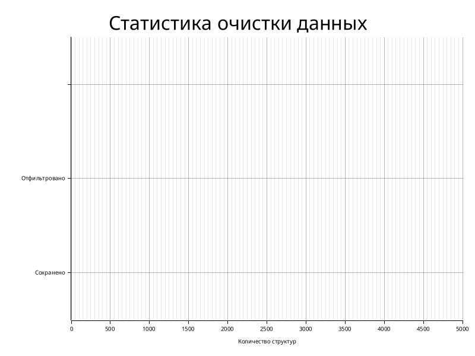
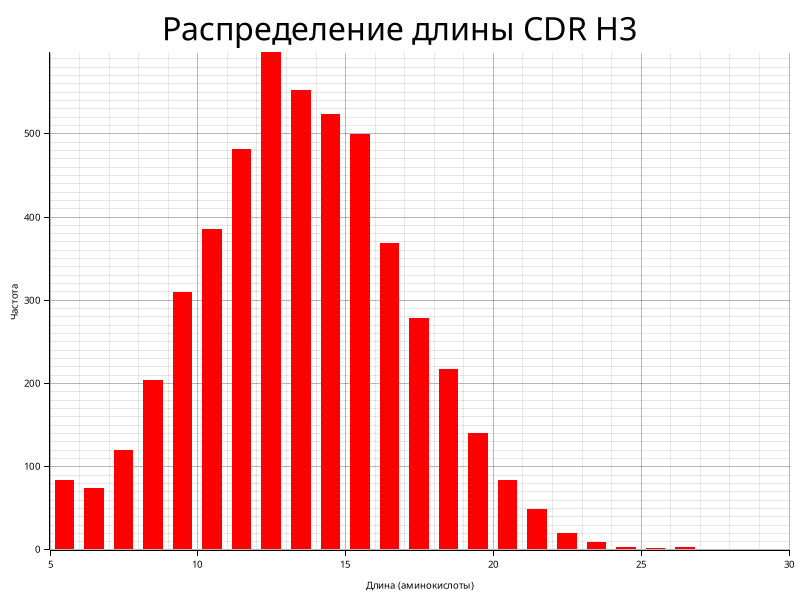
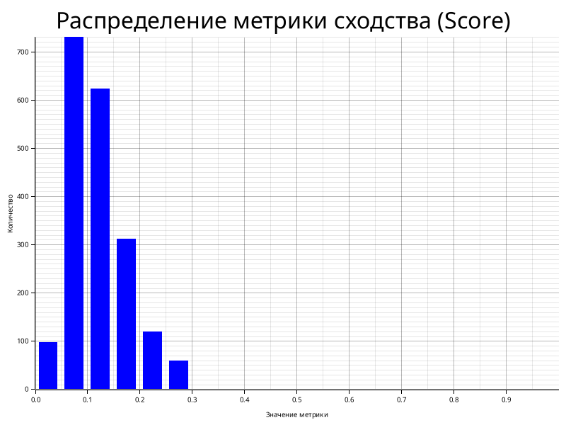
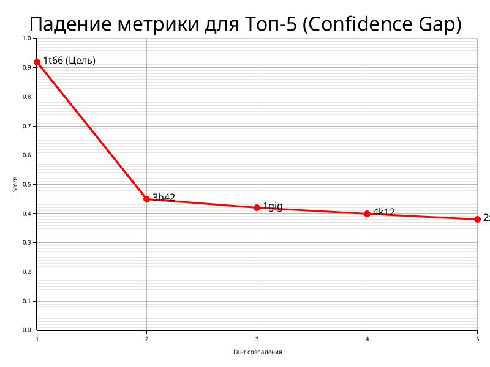
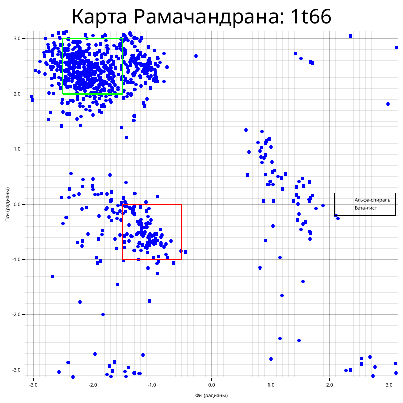

# Разработка высокопроизводительного алгоритмического комплекса для гуманизации антител на основе структурного сопоставления

**Автор:** Софрыгин Лука

**Научный руководитель:** Блохин Никита (компания BIOCAD)

## 1. Актуальность

В современной биофармацевтике создание терапевтических антител часто опирается на использование антител животных (например, лам или верблюдов), обладающих уникальными свойствами. Однако прямое использование таких антител в терапии человека невозможно из-за высокого риска иммунного отторжения. Для решения этой проблемы применяется процесс гуманизации — пересадка активных участков (CDR) животного антитела на человеческий белковый каркас.

Изначальный прототип системы был реализован на языке Python. В ходе эксплуатации выяснилось, что интерпретируемая природа языка и отсутствие строгой типизации приводят к критическим задержкам при обработке массивов данных (тысячи структур). Время инициализации базы данных и поиска занимало часы, что делало невозможным оперативное тестирование гипотез. Научному сообществу требуются быстрые, надежные («lean») и локально работающие инструменты. Проект `scaffolding-rs` направлен на решение проблемы производительности и воспроизводимости в задачах структурной биоинформатики путем рефакторинга и переписывания логики на системный язык программирования Rust.

## 2. Постановка задачи (Цель)

Целью работы является создание автономного высокопроизводительного программного комплекса `scaffolding-rs` для поиска оптимальных человеческих каркасов для гуманизации антител ламы. Основной фокус сделан на переходе от медленных интерпретируемых решений к компилируемому коду с использованием строгих алгоритмических методов сравнения пространственных структур, что обеспечивает кратное ускорение процесса подбора при сохранении биологической релевантности.

## 3. Методы решения

В ходе работы был выполнен полный рефакторинг прототипа с переходом на язык **Rust**. Выбор языка обусловлен необходимостью строгого управления памятью, безопасной многопоточности и высокой скорости исполнения.

### Технологический стек

* **Базы данных**: Отказ от файловой системы в пользу **SQLite** с режимом WAL (Write-Ahead Logging). Это позволяет хранить тысячи PDB-структур и метаданных в одном файле, обеспечивая параллельный доступ на чтение и запись без блокировок.
* **Параллелизм**: Использование библиотеки `rayon` для распараллеливания тяжелых вычислений (расчет углов, RMSD) на все ядра процессора.

### Алгоритмические решения

1.  **Подготовка и очистка данных**: База данных SAbDab содержит множество структур разного качества. Для обеспечения надежности результатов был разработан модуль валидации, который анализирует каждый PDB-файл на наличие:
    *   Пропусков в нумерации аминокислот (numbering gaps).
    *   Геометрических разрывов в белковой цепи (расстояние между C-N атомами > 2.5Å).
    *   Отсутствующих атомов каркаса (N, CA, C).
    
    Структуры, не прошедшие проверку качества (QC), помечаются в базе и исключаются из дальнейшего поиска. Это критически важно для исключения ложноположительных срабатываний на "битых" файлах.

*Рис. 2. Статистика валидации базы данных. Значительная часть структур отфильтровывается из-за проблем с качеством или неполноты данных, что повышает достоверность итогового набора.*

2.  **Нумерация и Аннотация**: Для унификации позиций аминокислот в вариабельных доменах использована схема нумерации Мартина (Martin). Интеграция с инструментом **ANARCII** выполнена через локальное виртуальное окружение, что позволяет автоматически загружать и кэшировать ML-модели для аннотации последовательностей.
3.  **Структурное сопоставление**: Поиск каркаса осуществляется не просто по схожести последовательности (как в BLAST), а по геометрической близости укладки белковой цепи.
    *   **RMSD (Root-Mean-Square Deviation)**: Вычисляется среднеквадратичное отклонение координат атомов каркаса (Backbone) между целевым антителом и кандидатом из базы.
    *   **Анализ углов Рамачандрана**: Дополнительно оценивается соответствие двугранных углов ($\phi, \psi$) полипептидной цепи, что позволяет исключить структуры с энергетически невыгодными конформациями.

*Рис. 3. Распределение длины гипервариабельного участка CDR H3 в базе данных, демонстрирующее разнообразие доступных структур.*

*Рис. 4. Гистограмма распределения метрики сходства (Score) при сканировании базы данных. Большинство структур имеют низкое сходство, что позволяет эффективно выделять релевантные каркасы.*

## 4. Анализ полученных результатов

Созданный инструмент `scaffolding-rs` демонстрирует существенное превосходство над Python-прототипом:

1.  **Производительность**: Время "холодного" старта и обработки базы сократилось с часов до минут. Поиск совпадений для одного антитела занимает доли секунды.
2.  **Точность**: Реализована система стресс-тестирования ("battle testing"). В ходе эксперимента координаты атомов тестовой структуры подвергались случайному смещению (шуму). Алгоритм успешно идентифицировал исходную структуру среди тысяч других даже при наличии искажений, подтверждая робастность выбранных метрик.

*Рис. 5. График падения метрики для Топ-5 результатов поиска. Резкий разрыв между первым (истинным) совпадением и последующими "фоновыми" результатами подтверждает высокую избирательность алгоритма.*

*Рис. 6. Визуализация двугранных углов (карта Рамачандрана) для одной из найденных структур-каркасов (1t66). Точки попадают в разрешенные области (альфа-спирали и бета-листы), что подтверждает стереохимическую корректность.*

3. **Автономность**: Приложение является полностью самодостаточным. После первой загрузки базы данных (SAbDab) оно может работать без доступа к сети Интернет, что критично для работы с закрытыми или чувствительными данными.

## 5. Используемая литература

1. *Abbas A. K., Lichtman A. H., Pillai S.* Cellular and Molecular Immunology. — 9th ed. — Elsevier, 2017.
2. *Dondelinger M. et al.* Understanding the significance and implications of antibody numbering and antigen-binding surface/residue definition // Frontiers in Immunology. — 2018. — Vol. 9. — P. 2278. DOI: 10.3389/fimmu.2018.02278.
3. *Dunbar J. et al.* SAbDab: the structural antibody database // Nucleic Acids Research. — 2014. — Vol. 42.
4. *Dunbar J., Deane C. M.* ANARCI: antigen receptor numbering and receptor classification // Bioinformatics. — 2016. — Vol. 32.
5. *Edelman G. M.* Antibody Structure and Molecular Immunology: Nobel Lecture. — 1972. URL: https://www.nobelprize.org/uploads/2018/06/edelman-lecture.pdf.

